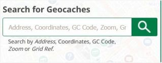
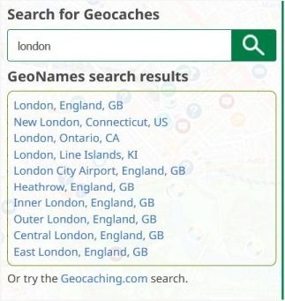
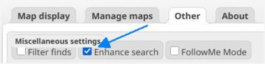
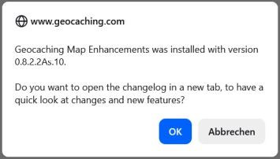

<a href="#v0822As10" title="GME version 0.8.2.2As.10 (08.04.2026)">v0.8.2.2As.10</a> &nbsp;
<a href="#v0822As9" title="GME version 0.8.2.2As.9 (02.10.2025)">v0.8.2.2As.9</a> &nbsp;
<a href="#v0822As8" title="GME version 0.8.2.2As.8 (28.04.2024)">v0.8.2.2As.8</a> &nbsp;
<a href="#v0822As7" title="GME version 0.8.2.2As.7 (15.04.2024)">v0.8.2.2As.7</a> &nbsp;
<a href="#v0822As6" title="GME version 0.8.2.2As.6 (31.01.2023)">v0.8.2.2As.6</a> &nbsp;

---
## v0.8.2.2As.10:
&nbsp; &nbsp;  
<ul>
	<li>
		<strong>Note:</strong> [Docu] What should be considered when using the GC little helper II script simultaneously. [<a href="https://github.com/2Abendsegler/GME/issues/65" title="Issue 65">65</a> / <a href="https://www.geocaching.com/profile/?u=2Abendsegler" title="Thanks to 2Abendsegler">2Abendsegler</a>] 
		To use map layers from GME, you must disable map layer processing in GC little helper II. 
		Further information can be found in <a href="https://github.com/2Abendsegler/GME/blob/main/docu/faq.md#6-en" title="FAQ 6. on GitHub">FAQ 6</a>.  
	</li>
	<li>
		<strong>New:</strong> [Browse Map] Improve the enhanced search box. [<a href="https://github.com/2Abendsegler/GME/issues/68" title="Issue 68">68</a> / <a href="https://www.geocaching.com/profile/?u=2Abendsegler" title="Thanks to 2Abendsegler">2Abendsegler</a>] 
		With the enhance search feature you can search for an Address, a GC Code, for Coordinates and Zoom or Grid Ref. 
		 
		For example, a search by address. 
		 
		This feature is not new. If you want to use it, maybe you have to activate it. 
		  
	</li>
	<li>
		<strong>Fix:</strong> [Listing, Browse Map] Drag cache type with waypoints and drop to map doesn't work. [<a href="https://github.com/2Abendsegler/GME/issues/63" title="Issue 63">63</a> / <a href="https://www.geocaching.com/profile/?u=2Abendsegler" title="Thanks to 2Abendsegler">2Abendsegler</a>] 
		Further information can be found in <a href="https://github.com/2Abendsegler/GME/issues/63" title="Issue 63">issue 63</a>.  
	</li>
	<li>
		<strong>Fix:</strong> [Browse Map] Reintegrate GME button into the sidebar. [<a href="https://github.com/2Abendsegler/GME/issues/67" title="Issue 67">67</a> / <a href="https://www.geocaching.com/profile/?u=2Abendsegler" title="Thanks to 2Abendsegler">2Abendsegler</a>] 
		Further information can be found in <a href="https://github.com/2Abendsegler/GME/issues/67" title="Issue 67">issue 67</a>.  
	</li>
	<li>
		<strong>Fix:</strong> [Global] Reorganization of map layers that no longer work. [<a href="https://github.com/2Abendsegler/GME/issues/77" title="Issue 77">77</a> / <a href="https://www.geocaching.com/profile/?u=2Abendsegler" title="Thanks to 2Abendsegler">2Abendsegler</a>] 
		Further information can be found in <a href="https://github.com/2Abendsegler/GME/issues/77" title="Issue 77">issue 77</a>.  
	</li>
	<li>
		<strong>New:</strong> [Browse Map] Improve the alignment of the icons on the left side. [<a href="https://github.com/2Abendsegler/GME/issues/69" title="Issue 69">69</a> / <a href="https://www.geocaching.com/profile/?u=2Abendsegler" title="Thanks to 2Abendsegler">2Abendsegler</a>] 
		Further information can be found in <a href="https://github.com/2Abendsegler/GME/issues/69" title="Issue 69">issue 69</a>.  
	</li>
	<li>
		<strong>New:</strong> [Global] Improve the alignment of the settings. [<a href="https://github.com/2Abendsegler/GME/issues/74" title="Issue 74">74</a> / <a href="https://www.geocaching.com/profile/?u=2Abendsegler" title="Thanks to 2Abendsegler">2Abendsegler</a>] 
		Further information can be found in <a href="https://github.com/2Abendsegler/GME/issues/74" title="Issue 74">issue 74</a>.  
	</li>
	<li>
		<strong>New:</strong> [Global] Improve notification of version changes. [<a href="https://github.com/2Abendsegler/GME/issues/73" title="Issue 73">73</a> / <a href="https://www.geocaching.com/profile/?u=2Abendsegler" title="Thanks to 2Abendsegler">2Abendsegler</a>] 
		  
	</li>
	<li>
		<strong>Fix:</strong> [Browse Map] Settings disappear behind the page header of the GClh. [<a href="https://github.com/2Abendsegler/GME/issues/70" title="Issue 70">70</a> / <a href="https://www.geocaching.com/profile/?u=2Abendsegler" title="Thanks to 2Abendsegler">2Abendsegler</a>] 
	</li>
	<li>
		<strong>Fix:</strong> [Browse Map] Error when using map preferences Google maps. [<a href="https://github.com/2Abendsegler/GME/issues/64" title="Issue 64">64</a> / <a href="https://www.geocaching.com/profile/?u=2Abendsegler" title="Thanks to 2Abendsegler">2Abendsegler</a>] 
	</li>
	<li>
		<strong>Fix:</strong> [Global] GME update notification appears every time a page is loaded. [<a href="https://github.com/2Abendsegler/GME/issues/78" title="Issue 78">78</a> / <a href="https://www.geocaching.com/profile/?u=2Abendsegler" title="Thanks to 2Abendsegler">2Abendsegler</a>] 
	</li>
	<li>
		<strong>Fix:</strong> [Global] Further problems with multiple executions of GME. [<a href="https://github.com/2Abendsegler/GME/issues/71" title="Issue 71">71</a> / <a href="https://www.geocaching.com/profile/?u=2Abendsegler" title="Thanks to 2Abendsegler">2Abendsegler</a>] 
	</li>
	<li>
		<strong>Fix:</strong> [Docu] Link for add on tampermonkey changed for browser Microsoft Edge. [<a href="https://github.com/2Abendsegler/GME/issues/76" title="Issue 76">76</a> / <a href="https://www.geocaching.com/profile/?u=2Abendsegler" title="Thanks to 2Abendsegler">2Abendsegler</a>] 
	</li>
</ul>
 
(08.04.2026) 
released by <a href="https://www.geocaching.com/profile/?u=2Abendsegler">2Abendsegler</a> 
 

---
## v0.8.2.2As.9:
&nbsp; &nbsp;  
<ul>
	<li>
		<strong>Fix:</strong> [Browse Map] When printing the map parts on the left side are missing. [<a href="https://github.com/2Abendsegler/GME/issues/55" title="Issue 55">55</a> / <a href="https://www.geocaching.com/profile/?u=Die Batzen" title="Thanks to Die Batzen">Die Batzen</a>] 
	</li>
</ul>
 
(02.10.2025) 
released by <a href="https://www.geocaching.com/profile/?u=2Abendsegler">2Abendsegler</a> 
 

---
## v0.8.2.2As.8:
&nbsp; &nbsp;  
<ul>
	<li>
		<strong>Fix:</strong> [Global] ft in route tool in the setting Imperial measurements are displayed in meters. [<a href="https://github.com/2Abendsegler/GME/issues/46" title="Issue 46">46</a> / <a href="https://www.geocaching.com/profile/?u=2Abendsegler" title="Thanks to 2Abendsegler">2Abendsegler</a>] 
	</li>
</ul>
 
(28.04.2024) 
released by <a href="https://www.geocaching.com/profile/?u=2Abendsegler">2Abendsegler</a> 
 

---
## v0.8.2.2As.7:
&nbsp; &nbsp;  
<ul>
	<li>
		<strong>New:</strong> [Browse Map] Specify number of decimals for the measured distance of the route. [<a href="https://github.com/2Abendsegler/GME/issues/40" title="Issue 40">40</a> / <a href="https://www.geocaching.com/profile/?u=2Abendsegler" title="Thanks to 2Abendsegler">2Abendsegler</a>] 
		Further information can be found in <a href="https://github.com/2Abendsegler/GME/issues/40" title="Issue 40">issue 40</a>. 
	</li>
	<li>
		<strong>New:</strong> [Browse Map] Copy coordinates from the Route Tool popup via mouse click to the clipboard. [<a href="https://github.com/2Abendsegler/GME/issues/38" title="Issue 38">38</a> / <a href="https://www.geocaching.com/profile/?u=2Abendsegler" title="Thanks to 2Abendsegler">2Abendsegler</a>] 
		Further information can be found in <a href="https://github.com/2Abendsegler/GME/issues/38" title="Issue 38">issue 38</a>. 
	</li>
	<li>
		<strong>Fix:</strong> [Browse Map] Right mouse on cache detail popup set route tool marker. [<a href="https://github.com/2Abendsegler/GME/issues/35" title="Issue 35">35</a> / <a href="https://www.geocaching.com/profile/?u=2Abendsegler" title="Thanks to 2Abendsegler">2Abendsegler</a>] 
	</li>
	<li>
		<strong>Fix:</strong> [FAQ] New cookie accepting popups. [<a href="https://github.com/2Abendsegler/GME/issues/34" title="Issue 34">34</a> / <a href="https://www.geocaching.com/profile/?u=2Abendsegler" title="Thanks to 2Abendsegler">2Abendsegler</a>] 
	</li>
</ul>
 
(15.04.2024) 
released by <a href="https://www.geocaching.com/profile/?u=2Abendsegler">2Abendsegler</a> 
 

---
## v0.8.2.2As.6:
&nbsp; &nbsp;  
<ul>
	<li>
		<strong>Fix:</strong> [Listing] Reference error L is not defined (map). No GME features in minimap. (Cookiebot Problem). [<a href="https://github.com/2Abendsegler/GME/issues/17" title="Issue 17">17</a> / <a href="https://www.geocaching.com/profile/?u=2Abendsegler" title="Thanks to 2Abendsegler">2Abendsegler</a>] 
	</li>
	<li>
		<strong>Fix:</strong> [Listing / Browse Map] Reference error $ is not defined and other errors. No blue line between original and corrected Coordinates. (Cookiebot Problem). [<a href="https://github.com/2Abendsegler/GME/issues/14" title="Issue 14">14</a> / <a href="https://www.geocaching.com/profile/?u=2Abendsegler" title="Thanks to 2Abendsegler">2Abendsegler</a>] 
	</li>
</ul>
 

(31.01.2023) 
released by <a href="https://www.geocaching.com/profile/?u=2Abendsegler">2Abendsegler</a> 
 
